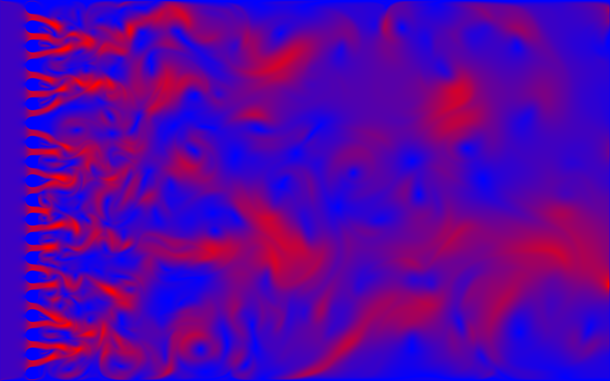

# Symbolically generated GPU-based LBM

Experimental generation of OpenCL kernels using SymPy, Mako and PyOpenCL.

* Implements a straight forward AB pattern
* All memory offsets are statically resolved
* Underlying symbolic formulation is optimized using CSE
* Characteristic constants of D2Q9 and D3Q27 are transparently recovered using only discrete velocities

## Performance

Theoretical maximum performance on tested hardware:

| GPU    | Bandwidth   | D2Q9   | &nbsp; | D3Q19  | &nbsp; | D3Q27  | &nbsp; | 
| ------ | ----------- | ------ | ------ | ------ | ------ | ------ | ------ |
| &nbsp; | &nbsp;      | single | double | single | double | single | double | 
| K2200  | 63.2 GiB/s  | 893    | 459    | 435    |  220   |  308   | 156    |
| P100   | 512.6 GiB/s | 7242   | 3719   | 3528   | 1787   | 2502   | 1262   |

### Maximum measured performance...

| GPU    | D2Q9   | &nbsp; | D3Q19  | &nbsp; | D3Q27  | &nbsp; |
| ------ | ------ | ------ | ------ | ------ | ------ | ------ |
| &nbsp; | single | double | single | double | single | double |
| K2200  | 843.4  | 326.4  | 423.2  | 163.8  | 303.0  | 116.0  |
| P100   | 6957.4 | 3585.0 | 3420.2 | 1763.8 | 2374.6 | 1259.6 |

### ...relative to theoretical maximum

| GPU    | D2Q9   | &nbsp; | D3Q19  | &nbsp; | D3Q27  | &nbsp; |
| ------ | ------ | ------ | ------ | ------ | ------ | ------ |
| &nbsp; | single | double | single | double | single | double |
| K2200  | 94.4%  | 71.1%  | 97.3%  | 74.5%  | 98.4%  | 74.4%  |
| P100   | 96.1%  | 96.4%  | 96.9%  | 98.7%  | 94.9%  | 99.8%  |

### CSE impact on P100

| CSE    | D2Q9   | &nbsp; | D3Q19  | &nbsp; | D3Q27  | &nbsp; |
| ------ | ------ | ------ | ------ | ------ | ------ | ------ |
| &nbsp; | single | double | single | double | single | double |
| No     | 6957.4 | 2814.4 | 2581.8 |  998.8 | 1576.4 |  647.4 |
| Yes    | 6922.4 | 3585.0 | 3420.2 | 1763.8 | 2374.6 | 1259.6 |

| CSE    | D2Q9   | &nbsp; | D3Q19  | &nbsp; | D3Q27  | &nbsp; |
| ------ | ------ | ------ | ------ | ------ | ------ | ------ |
| &nbsp; | single | double | single | double | single | double |
| No     | 96.1%  | 75.7%  | 73.2%  | 55.9%  | 63.0%  | 51.3%  |
| Yes    | 95.6%  | 96.4%  | 96.9%  | 98.7%  | 94.9%  | 99.8%  |

For more details see the `results/` and `notebook/` directories.

## Visualization

`cavity_2d_gl_interop.py` and `channel_2d_gl_interop.py` implement basic real-time visualization of the velocity field.

See [symlbmgpu_channel_with_obstacles](http://static.kummerlaender.eu/media/symlbmgpu_channel_with_obstacles.mp4) (MP4, 25 MiB) for a short recording of how this looks.
